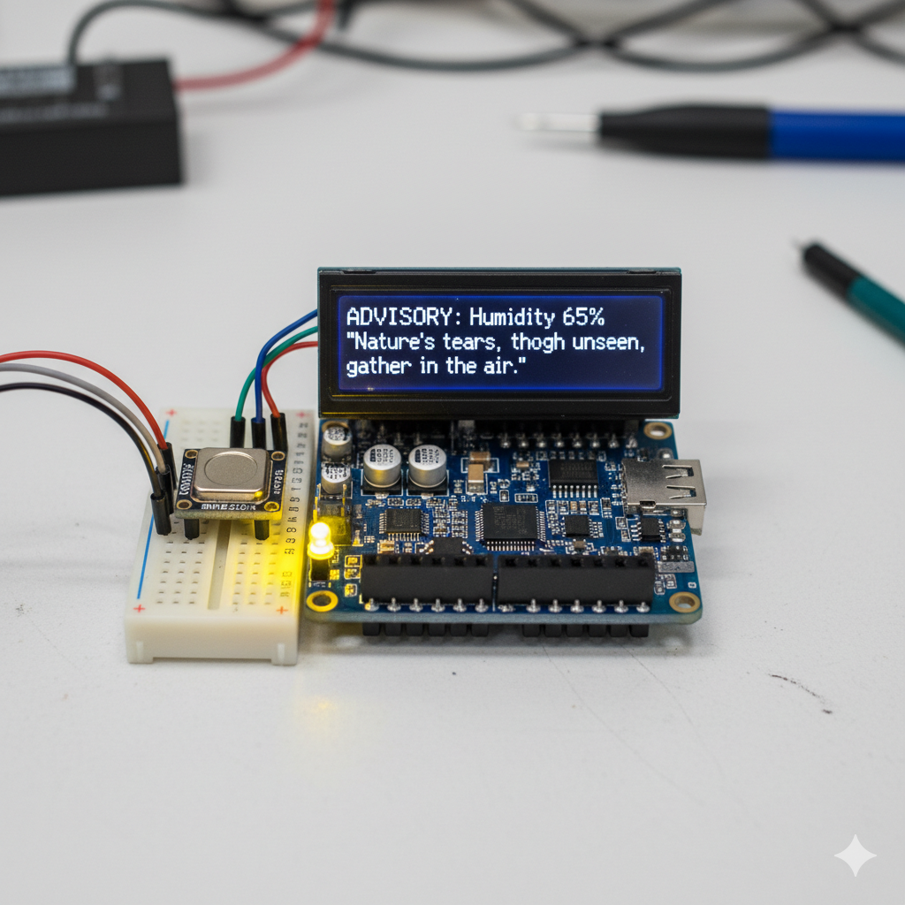
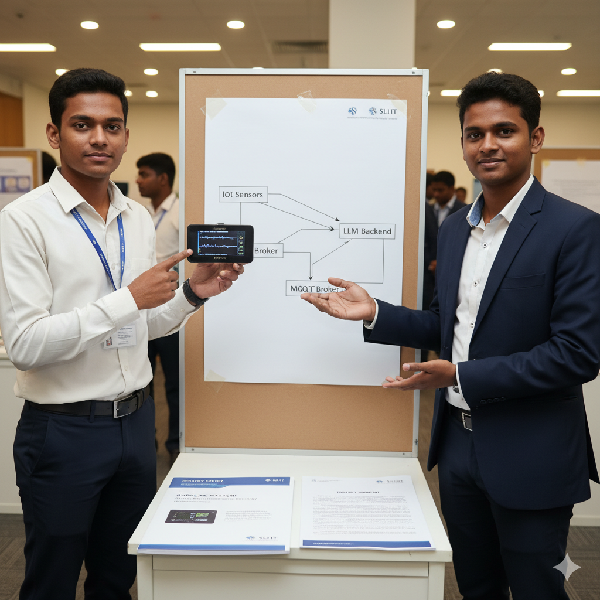

# 🌐 AuraLink – Smart Agentic IoT Device

AuraLink is a smart IoT prototype that connects environmental sensing with AI intelligence.  
It fuses an **ESP32 microcontroller** and **DHT22/BME280 sensors** with an **AI backend (LangChain + OpenAI API)**  
to generate poetic quotes and email summaries in real-time, displayed on an OLED screen with RGB urgency indicators.

---

## 🏗️ Project Structure
AuraLink-Smart-Agentic-IoT-Device/
│
├── esp32/ → Arduino firmware (ESP32 + DHT22 + OLED + MQTT)
├── backend/ → Python backend (LangChain + MQTT + Gmail API)
├── docs/ → Proposal, images, and architecture diagrams
│
├── README.md
└── .gitignore

yaml
Copy code

---

## ⚙️ ESP32 Firmware Setup

1. Open Arduino IDE → Load `esp32/Aura_tec.ino`
2. Install libraries:
   - WiFi  
   - PubSubClient  
   - Adafruit_GFX  
   - Adafruit_SSD1306  
   - DHT sensor library  
3. Change your WiFi credentials inside the code:
   ```cpp
   const char* ssid = "WIFI_SSID";
   const char* password = "WIFI_PASSWORD";
Select Board: “ESP32 Dev Module”

Upload and open Serial Monitor

🧠 Backend Setup
Requirements
bash
Copy code
pip install -r backend/requirements.txt
Environment
bash
Copy code
setx OPENAI_API_KEY "openai_api_key_here"       # Windows
export OPENAI_API_KEY="openai_api_key_here"     # Linux/Mac
Run Backend
bash
Copy code
cd backend
python aurabackend.py
Backend connects to:

MQTT Broker: broker.hivemq.com

Topics:

Publish → auralink/sensors/data

Subscribe → auralink/display/output

🌈 OLED + LED Display Logic
Urgency	LED Color	Description
green	🟢	Normal – No urgent emails, stable conditions
yellow	🟡	Advisory – Humidity high or flagged email
red	🔴	Critical – Urgent email or abnormal temperature

🧩 Hardware Used
ESP32 Dev Board

DHT22 / BME280 Sensor

0.96” OLED (I2C: SDA=21, SCL=22)

RGB LED (Pins 25, 26, 27)

Breadboard + Power supply

📡 Communication Flow
ESP32 reads temp + humidity.

Publishes via MQTT → auralink/sensors/data.

Backend receives → generates:

Literature quote

Email summary + urgency color

Publishes response → auralink/display/output.

ESP32 displays both + updates LED color.

## 📸 System Overview

### Device Prototype


### Team Members


### Value Proposition


📘 License
MIT License © 2025 – AuraLink Project Team


Fernando M.G.S.S.A (IT19970882)
Perera B.C.V (IT20196110)

yaml
Copy code
